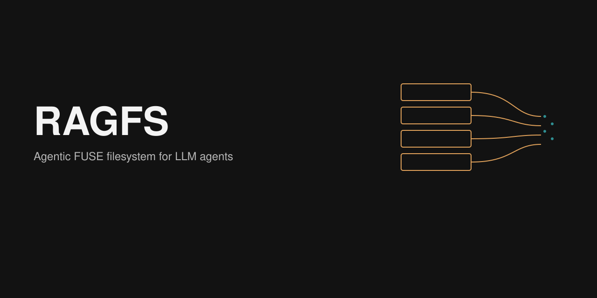

<p align="center">
  
</p>

# RAGFS

<p align="center">
  <a href="https://github.com/gianlucamazza/ragfs/actions/workflows/ci.yml"></a>
  <a href="https://github.com/gianlucamazza/ragfs/actions/workflows/security.yml"></a>
  <a href="https://codecov.io/gh/gianlucamazza/ragfs"></a>
  <a href="https://gianlucamazza.github.io/ragfs/ragfs/"></a>
  <a href="LICENSE-MIT"></a>
  <a href="https://www.rust-lang.org"></a>
</p>

Agentic FUSE filesystem for LLM agents: structured file ops with JSON feedback, soft-delete and undo, audit logging, and local semantic search.

```
File → Extract → Chunk → Embed (gte-small, 384-d) → LanceDB → Query
```

All processing stays on the machine. The first run downloads `thenlper/gte-small` (~67–100 MB) unless `HF_HUB_OFFLINE=1` and a cache is already present.

## Quick start

GitHub Release `v0.2.0` ships the Linux CLI only (crates.io and PyPI are not used).

```bash
tar -xzf ragfs-linux-x86_64.tar.gz
sudo install ragfs /usr/local/bin/ragfs

# or from source: Rust 1.91+, libfuse-dev, protobuf-compiler
cargo install --path crates/ragfs
```

Archives: `ragfs-linux-x86_64.tar.gz` and `ragfs-linux-aarch64.tar.gz`, each with a `.sha256`. macOS is not a supported FUSE product.

```bash
ragfs index ~/Documents
ragfs query ~/Documents "authentication logic"
ragfs status ~/Documents

mkdir ~/ragfs-mount
ragfs mount ~/Documents ~/ragfs-mount --foreground
```

Agents talk to the mount through `.ragfs/.ops/`, `.ragfs/.safety/`, and `.ragfs/.semantic/`. Full walkthrough: [Getting Started](docs/GETTING_STARTED.md). CLI details: [User Guide](docs/USER_GUIDE.md).

```bash
echo -e "docs/new.md\n# New Document" > ~/ragfs-mount/.ragfs/.ops/.create
cat ~/ragfs-mount/.ragfs/.ops/.result   # JSON with undo_id
```

## Features

| | Stable | Beta / experimental |
|---|---|---|
| **Search** | Semantic query, hybrid (vector + FTS), FUSE mount (Linux) | Semantic organize / dedupe / cleanup |
| **Extract** | UTF-8 text/code/markup, PDF, images, OOXML/ODT | Image captioning (`vision` feature) |
| **Agents** | `.ops/` JSON ops, `.safety/` trash + undo | Python bindings, MCP server |
| **Index** | Watch mode, code chunking at function/class signatures | |

Local embeddings via Candle. Code splits are pattern-based, not a tree-sitter AST.

## Limits

- Linux only.
- `ragfs index` without `--watch` does not drop chunks for files that vanished while the process was down.
- Default extractors skip binary `.doc` / RTF / EPUB.
- Vector search is an exact scan until cosine IVF-PQ is built (≥256 chunks). L2/Dot stay exact.
- Indices live under `~/.local/share/ragfs/` (`RAGFS_DATA_DIR` overrides).

## Documentation

**Use** — [Getting Started](docs/GETTING_STARTED.md) · [User Guide](docs/USER_GUIDE.md) · [Configuration](docs/CONFIGURATION.md) · [Performance](docs/PERFORMANCE.md) · [Troubleshooting](docs/TROUBLESHOOTING.md)

**Integrate** — [Python](docs/PYTHON.md) · [MCP](docs/MCP.md) · [API](docs/API.md)

**Develop** — [Architecture](docs/ARCHITECTURE.md) · [ADRs](docs/ARCHITECTURE_DECISIONS.md) · [Development](docs/DEVELOPMENT.md) · [Contributing](CONTRIBUTING.md) · [Audit tracker](docs/AUDIT.md)

## Contributing

See [CONTRIBUTING.md](CONTRIBUTING.md). `make ci` runs the same gates as GitHub Actions (fmt, clippy, tests, cargo-deny).

## License

Licensed under either of [Apache-2.0](LICENSE-APACHE) or [MIT](LICENSE-MIT) at your option.
