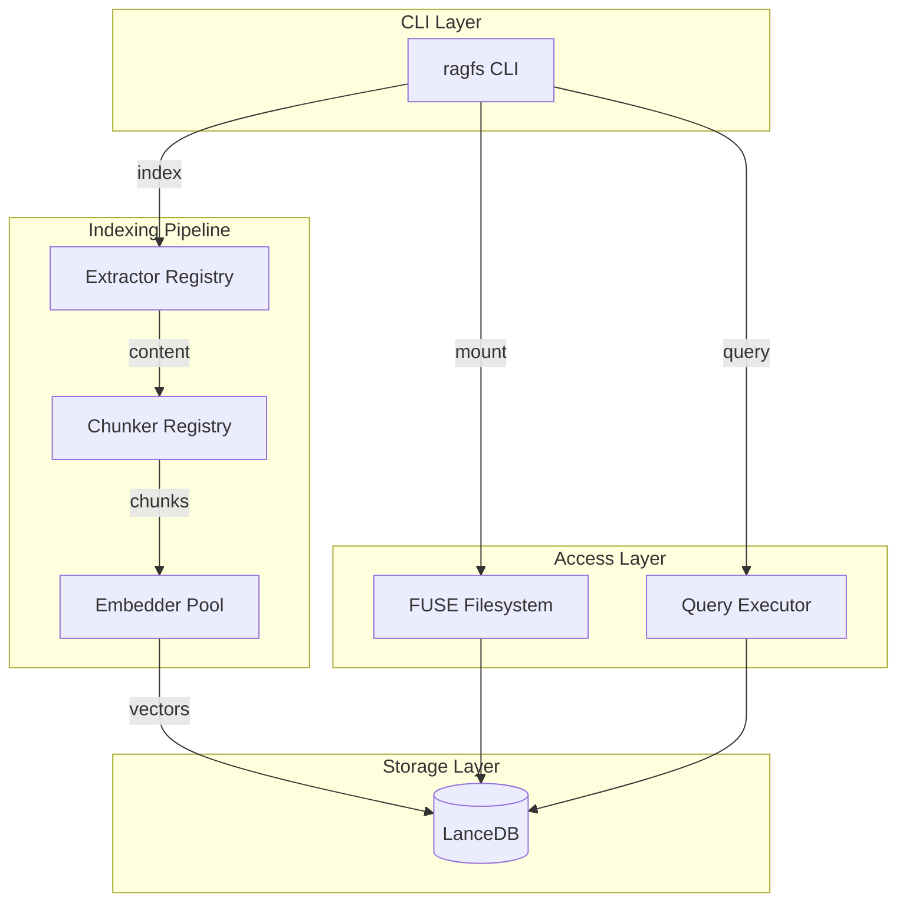
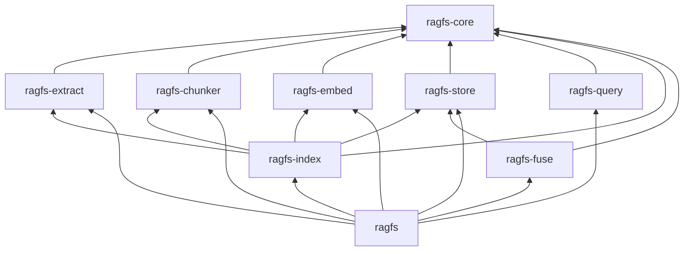
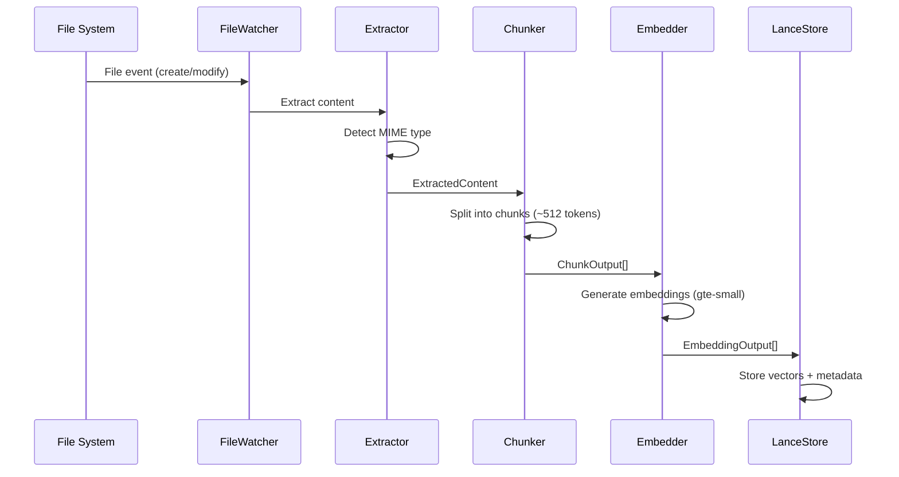

# RAGFS Architecture

This document provides a technical overview of the RAGFS architecture for developers and advanced users.

## High-Level Overview

RAGFS is a modular system that indexes files, generates vector embeddings, and enables semantic search. The architecture follows a pipeline pattern where content flows through extraction, chunking, embedding, and storage stages.



## Crate Dependency Graph



## Data Flow

### Indexing Pipeline



### Query Pipeline

```mermaid
sequenceDiagram
    participant U as User
    participant Q as QueryExecutor
    participant M as Embedder
    participant S as LanceStore

    U->>Q: "machine learning implementation"
    Q->>M: Embed query text
    M->>Q: Query vector [f32; 384]
    Q->>S: Vector similarity search
    S->>S: ANN search (cosine)
    S->>Q: SearchResult[]
    Q->>U: Ranked results with content
```

## Component Details

### ragfs-core

The foundation crate defining all abstractions and shared types.

**Key Traits:**

| Trait | Purpose |
|-------|---------|
| `ContentExtractor` | Extract content from files |
| `Chunker` | Split content into chunks |
| `Embedder` | Generate vector embeddings |
| `VectorStore` | Store and search vectors |
| `Indexer` | Coordinate file indexing |

**Key Types:**

| Type | Description |
|------|-------------|
| `FileRecord` | Metadata about indexed files |
| `Chunk` | Content segment with embedding |
| `SearchResult` | Query result with score and content |
| `ExtractedContent` | Output from content extraction |
| `ChunkConfig` | Chunking parameters |
| `EmbeddingConfig` | Embedding parameters |

### ragfs-extract

Content extraction from various file formats.

**Components:**
- `ExtractorRegistry` - Routes files to appropriate extractors by MIME type
- `TextExtractor` - Handles text-based files (40+ types supported)

**Supported Formats:**
- Text: `.txt`, `.md`, `.rst`
- Code: `.rs`, `.py`, `.js`, `.ts`, `.go`, `.java`, etc.
- Config: `.json`, `.yaml`, `.toml`, `.xml`
- Markup: `.html`, `.css`

### ragfs-chunker

Document chunking strategies for optimal embedding.

**Components:**
- `ChunkerRegistry` - Manages chunking strategies by content type
- `FixedSizeChunker` - Token-based chunking with overlap

**Configuration:**
- Target size: 512 tokens (default)
- Max size: 1024 tokens
- Overlap: 64 tokens
- Smart break detection (prefers newlines, sentence boundaries)

### ragfs-embed

Local embedding generation using the Candle ML framework.

**Components:**
- `CandleEmbedder` - Transformer-based embeddings using `gte-small`
- `EmbedderPool` - Concurrent embedding with semaphore limiting

**Model Details:**
- Model: `thenlper/gte-small`
- Dimension: 384
- Max tokens: 512
- Architecture: BERT
- Auto-downloads from Hugging Face Hub on first run

### ragfs-store

Vector storage and search using LanceDB.

**Components:**
- `LanceStore` - LanceDB-based vector store implementation

**Tables:**
- `chunks` - Vectors, content, metadata with ANN indexing
- `files` - File records with status and timestamps

**Features:**
- Lazy connection initialization
- Hybrid search (vector + full-text)
- Content-addressed storage (blake3 hashing)
- Incremental updates

### ragfs-index

File indexing engine coordinating the entire pipeline.

**Components:**
- `IndexerService` - Orchestrates extraction → chunking → embedding → storage
- `FileWatcher` - Monitors filesystem for changes using `notify` crate

**Configuration:**
```rust
IndexerConfig {
    chunk_config: ChunkConfig,
    embed_config: EmbeddingConfig,
    include_patterns: Vec<String>,  // default: ["**/*"]
    exclude_patterns: Vec<String>,  // default: [".git", "node_modules", ...]
}
```

**Events:**
- `IndexingStarted` - Indexing begun
- `FileIndexed` - File successfully indexed with chunk count
- `FileError` - Error processing file
- `FileRemoved` - File removed from index

### ragfs-query

Query parsing and execution.

**Components:**
- `QueryExecutor` - Executes semantic queries against the index
- `QueryParser` - Parses query strings with optional filters

**Search Options:**
- Vector similarity (cosine, L2, dot product)
- Hybrid search (vector + full-text)
- Filtering by path, MIME type, date range

### ragfs-fuse

FUSE filesystem implementation for mounting indexed directories.

**Components:**
- `RagFs` - Main FUSE filesystem handler
- `InodeTable` - Virtual inode management

**Virtual Structure:**
- Pass-through access to source files
- Special `.ragfs/` directory for metadata (planned)

## Key Design Decisions

### 1. Local-First Embeddings

RAGFS uses Candle for local embedding generation rather than external APIs:
- **Privacy**: All data stays on your machine
- **Offline**: Works without internet after initial model download
- **Cost**: No API fees or rate limits

### 2. Content-Addressed Storage

Files are tracked using blake3 content hashes:
- Only re-process files that actually changed
- Efficient incremental indexing
- Consistent state across restarts

### 3. Registry Pattern

Extractors and chunkers use a registry pattern:
- Easy to add new file format support
- Pluggable strategies by content type
- Clean separation of concerns

### 4. Async-First Design

Built on Tokio for concurrent operations:
- Parallel file processing
- Non-blocking I/O
- Efficient resource utilization

## Extension Points

### Adding a New Extractor

1. Implement the `ContentExtractor` trait
2. Register with `ExtractorRegistry`
3. Map MIME types to your extractor

### Adding a New Chunking Strategy

1. Implement the `Chunker` trait
2. Register with `ChunkerRegistry`
3. Map content types to your chunker

### Custom Embedding Models

1. Implement the `Embedder` trait
2. Provide model loading and inference
3. Pass to `EmbedderPool` for concurrency control

## Performance Considerations

- **Batching**: Embeddings are generated in batches for efficiency
- **Concurrency**: `EmbedderPool` limits parallel embedding jobs (default: 4)
- **Debouncing**: File watcher debounces events to avoid redundant processing
- **ANN Search**: LanceDB uses approximate nearest neighbors for fast search
